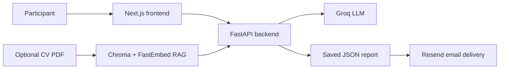

# Mini AI Interviewer

An AI-powered interview application that conducts a focused four-question
conversation, adapts its questions to the participant's answers, and produces a
final summary with the complete transcript.

Participants can optionally upload a CV as a PDF. Relevant experience is
retrieved from the document and supplied to the interviewer, allowing the
conversation to be personalized without making CV upload mandatory.

## Features

- Topic-based interviews with four adaptive questions
- Streaming responses from Groq
- Optional CV upload and retrieval-augmented generation (RAG)
- Final interview summary generated from the conversation
- Transcript and summary saved as a JSON report
- User-selected report delivery by email with a JSON attachment
- Request validation, upload limits, session cleanup, and rate limiting
- Responsive Next.js interface

## How it works



1. The participant chooses an interview topic.
2. The backend asks four numbered questions and adapts them to previous answers.
3. If a CV was uploaded, relevant document chunks can guide the questions.
4. After the final answer, Groq generates a structured summary.
5. The transcript and summary are saved as a JSON file with a unique interview
   ID.
6. The participant can enter an email address and receive the completed report
   through Resend.

## Tech stack

| Layer | Technologies |
| --- | --- |
| Frontend | Next.js 16, React 19, TypeScript, Tailwind CSS |
| Backend | Python 3.11, FastAPI, LangChain |
| LLM | Groq (`llama-3.3-70b-versatile` by default) |
| RAG | ChromaDB, FastEmbed, PyPDF |
| Email | Resend |
| Persistence | Local JSON files |

## Project structure

```text
interview-bot/
├── backend/
│   ├── agent/
│   │   ├── emailer.py       # Resend report delivery
│   │   ├── interview.py     # Interview flow and prompt builders
│   │   ├── llm.py           # Groq model configuration
│   │   ├── prompts.py       # Interview prompt templates
│   │   ├── rag/             # PDF indexing and retrieval
│   │   ├── state.py         # Request and state models
│   │   └── storage.py       # JSON transcript persistence
│   ├── tests/
│   ├── app.py               # FastAPI routes and streaming
│   └── requirements.txt
├── frontend/
│   ├── app/
│   │   ├── chat/            # Interview page
│   │   ├── components/      # Interview chat component
│   │   └── page.tsx         # Landing page
│   └── package.json
└── README.md
```

## Prerequisites

- Python 3.11 or newer
- Node.js 22 LTS
- A [Groq API key](https://console.groq.com/keys)
- Optional: a [Resend API key](https://resend.com/api-keys) for email delivery

## Run locally

### 1. Backend

```bash
cd backend
python3 -m venv venv
source venv/bin/activate
python -m pip install -r requirements.txt
```

Create `backend/.env`:

```env
GROQ_API_KEY=your_groq_api_key
GROQ_MODEL=llama-3.3-70b-versatile

# Optional email delivery
RESEND_API_KEY=your_resend_api_key
EMAIL_FROM="AI Interviewer <results@mail.csongorosz.com>"

# Browser and upload configuration
ALLOWED_ORIGINS=["http://localhost:3000"]
MAX_UPLOAD_BYTES=10485760
MAX_DOCUMENT_SESSIONS=100
SESSION_TTL_SECONDS=3600
```

Start the API:

```bash
python -m uvicorn app:app --reload --host 127.0.0.1 --port 8000
```

### 2. Frontend

In a second terminal:

```bash
cd frontend
npm install
npm run dev
```

The frontend uses `http://localhost:8000` by default. To use another backend,
create `frontend/.env.local`:

```env
NEXT_PUBLIC_BACKEND_URL=http://127.0.0.1:8000
```

Open [http://localhost:3000](http://localhost:3000).

## Email configuration

The participant chooses the report recipient in the frontend. FastAPI validates
the address before Resend sends the summary and JSON attachment. The sender is
always controlled by the backend through `EMAIL_FROM`; users cannot change it.

The Resend testing sender (`onboarding@resend.dev`) can only send to the email
address associated with the Resend account. Sending reports to user-selected
recipients requires a verified sender domain and an `EMAIL_FROM` address using
that exact domain. This project uses `mail.csongorosz.com`.

The application stores API keys only in backend environment variables. Never
place `GROQ_API_KEY` or `RESEND_API_KEY` in a `NEXT_PUBLIC_` variable.

## API endpoints

| Method | Endpoint | Purpose |
| --- | --- | --- |
| `POST` | `/interview` | Stream the next question or final summary |
| `POST` | `/upload` | Upload and index an optional CV PDF |
| `DELETE` | `/sessions/{session_id}` | Release an uploaded-document session |
| `POST` | `/interviews/{interview_id}/email` | Email a saved report to the validated address in the request body |
| `GET` | `/health` | Check backend health and model configuration |

## Tests

Backend:

```bash
cd backend
source venv/bin/activate
python -m unittest discover -s tests -v
```

Frontend:

```bash
cd frontend
npm run lint
npm run build
```

Generated interview reports are stored under `backend/data/interviews/` by
default. This directory, local environment files, virtual environments, and
frontend build artifacts are excluded from Git.

## Deploy

The repository is an isolated monorepo: deploy `backend` and `frontend` as two
separate services from the same GitHub repository.

### 1. Deploy the backend to Railway

1. Create a Railway project and choose **Deploy from GitHub repo**.
2. Select this repository.
3. In the service settings, set **Root Directory** to `/backend`.
4. If Railway does not detect the start command from `backend/Procfile`, set the
   custom start command to:

   ```bash
   uvicorn app:app --host 0.0.0.0 --port $PORT
   ```

5. Add these Railway service variables. Values shown as placeholders must be
   replaced in the dashboard; never commit API keys.

   ```env
   GROQ_API_KEY=your_groq_api_key
   GROQ_MODEL=llama-3.3-70b-versatile
   RESEND_API_KEY=your_resend_api_key
   EMAIL_FROM=AI Interviewer <results@mail.csongorosz.com>
   ALLOWED_ORIGINS=["http://localhost:3000"]
   MAX_UPLOAD_BYTES=10485760
   MAX_DOCUMENT_SESSIONS=100
   SESSION_TTL_SECONDS=3600
   INTERVIEW_DATA_DIR=/app/data/interviews
   ```

6. Generate a public Railway domain under **Settings → Networking**.
7. Verify the deployment at `https://YOUR-RAILWAY-DOMAIN/health`.

Railway application files are not permanent storage. For reliable report email
delivery across restarts and redeployments, attach a Railway volume to the
backend service, mount it at `/app/data`, and keep
`INTERVIEW_DATA_DIR=/app/data/interviews`.

The optional CV vector stores are intentionally held in memory and expire after
the configured session TTL. Keep the demo backend on one replica unless this
session storage is moved to a shared service.

### 2. Deploy the frontend to Vercel

1. Import the same GitHub repository as a new Vercel project.
2. Set **Root Directory** to `frontend`.
3. Keep the detected **Next.js** framework preset and default build settings.
4. Add this environment variable for Production (and Preview if desired):

   ```env
   NEXT_PUBLIC_BACKEND_URL=https://YOUR-RAILWAY-DOMAIN
   ```

5. Deploy and copy the generated Vercel URL.

`NEXT_PUBLIC_BACKEND_URL` is included in the browser bundle at build time, so
redeploy the frontend after changing it.

### 3. Complete production CORS

After Vercel provides the production URL, update the Railway variable with a
valid JSON array containing the exact frontend origin:

```env
ALLOWED_ORIGINS=["https://YOUR-VERCEL-DOMAIN"]
```

Do not add a trailing slash. Redeploy or restart the Railway backend after the
change, then complete an interview from the Vercel site and send its report to
an email address you control.

## Next milestone

Add Dockerfiles and a Docker Compose setup for reproducible local orchestration.
