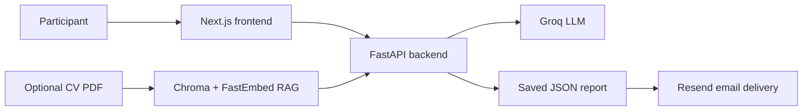

# Mini AI Interviewer

An AI-powered interview application that conducts a focused four-question
conversation, adapts its questions to the participant's answers, and produces a
final summary with the complete transcript.

Participants can optionally upload a CV as a PDF. Relevant experience is
retrieved from the document and supplied to the interviewer, allowing the
conversation to be personalized without making CV upload mandatory.

## Features

- Topic-based interviews with four adaptive questions
- Streaming responses from Groq
- Optional CV upload and retrieval-augmented generation (RAG)
- Final interview summary generated from the conversation
- Transcript and summary saved as a JSON report
- Optional report delivery by email with a JSON attachment
- Request validation, upload limits, session cleanup, and rate limiting
- Responsive Next.js interface

## How it works



1. The participant chooses an interview topic.
2. The backend asks four numbered questions and adapts them to previous answers.
3. If a CV was uploaded, relevant document chunks can guide the questions.
4. After the final answer, Groq generates a structured summary.
5. The transcript and summary are saved as a JSON file with a unique interview
   ID.
6. The completed report can optionally be emailed through Resend.

## Tech stack

| Layer | Technologies |
| --- | --- |
| Frontend | Next.js 16, React 19, TypeScript, Tailwind CSS |
| Backend | Python 3.11, FastAPI, LangChain |
| LLM | Groq (`llama-3.3-70b-versatile` by default) |
| RAG | ChromaDB, FastEmbed, PyPDF |
| Email | Resend |
| Persistence | Local JSON files |

## Project structure

```text
interview-bot/
├── backend/
│   ├── agent/
│   │   ├── emailer.py       # Resend report delivery
│   │   ├── interview.py     # Interview flow and prompt builders
│   │   ├── llm.py           # Groq model configuration
│   │   ├── prompts.py       # Interview prompt templates
│   │   ├── rag/             # PDF indexing and retrieval
│   │   ├── state.py         # Request and state models
│   │   └── storage.py       # JSON transcript persistence
│   ├── tests/
│   ├── app.py               # FastAPI routes and streaming
│   └── requirements.txt
├── frontend/
│   ├── app/
│   │   ├── chat/            # Interview page
│   │   ├── components/      # Interview chat component
│   │   └── page.tsx         # Landing page
│   └── package.json
└── README.md
```

## Prerequisites

- Python 3.11 or newer
- Node.js 22 LTS
- A [Groq API key](https://console.groq.com/keys)
- Optional: a [Resend API key](https://resend.com/api-keys) for email delivery

## Run locally

### 1. Backend

```bash
cd backend
python3 -m venv venv
source venv/bin/activate
python -m pip install -r requirements.txt
```

Create `backend/.env`:

```env
GROQ_API_KEY=your_groq_api_key
GROQ_MODEL=llama-3.3-70b-versatile

# Optional email delivery
RESEND_API_KEY=your_resend_api_key
EMAIL_FROM="AI Interviewer <results@mail.yourdomain.com>"

# Browser and upload configuration
ALLOWED_ORIGINS=["http://localhost:3000"]
MAX_UPLOAD_BYTES=10485760
MAX_DOCUMENT_SESSIONS=100
SESSION_TTL_SECONDS=3600
```

Start the API:

```bash
python -m uvicorn app:app --reload --host 127.0.0.1 --port 8000
```

### 2. Frontend

In a second terminal:

```bash
cd frontend
npm install
npm run dev
```

The frontend uses `http://localhost:8000` by default. To use another backend,
create `frontend/.env.local`:

```env
NEXT_PUBLIC_BACKEND_URL=http://127.0.0.1:8000
```

Open [http://localhost:3000](http://localhost:3000).

## Email configuration

The Resend testing sender (`onboarding@resend.dev`) can only send to the email
address associated with the Resend account. Sending reports to other recipients
requires a verified sender domain and an `EMAIL_FROM` address using that exact
domain.

The application stores API keys only in backend environment variables. Never
place `GROQ_API_KEY` or `RESEND_API_KEY` in a `NEXT_PUBLIC_` variable.

## API endpoints

| Method | Endpoint | Purpose |
| --- | --- | --- |
| `POST` | `/interview` | Stream the next question or final summary |
| `POST` | `/upload` | Upload and index an optional CV PDF |
| `DELETE` | `/sessions/{session_id}` | Release an uploaded-document session |
| `POST` | `/interviews/{interview_id}/email` | Email a saved interview report |
| `GET` | `/health` | Check backend health and model configuration |

## Tests

Backend:

```bash
cd backend
source venv/bin/activate
python -m unittest discover -s tests -v
```

Frontend:

```bash
cd frontend
npm run lint
npm run build
```

Generated interview reports are stored under `backend/data/interviews/` by
default. This directory, local environment files, virtual environments, and
frontend build artifacts are excluded from Git.

## Deployment plan

- Deploy the Next.js frontend to Vercel.
- Deploy the FastAPI backend to Railway.
- Configure production environment variables on each platform.
- Add Dockerfiles and a Docker Compose setup for local orchestration.

Docker and production deployment are intentionally listed as the next project
milestones rather than completed features.
